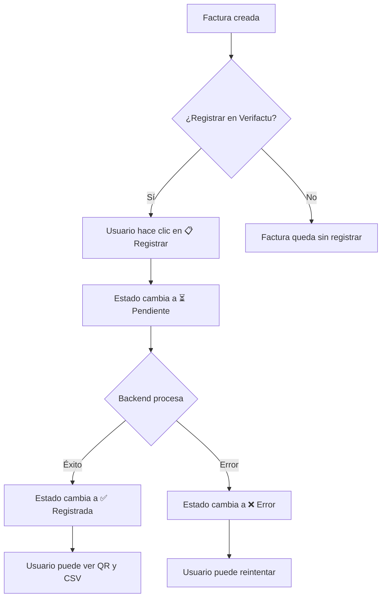

# 🔗 Integración Frontend-Backend con Verifactu

Guía completa para conectar el frontend de Anclora Flow con el backend y habilitar todas las funcionalidades de Verifactu.

## 📋 Estado Actual

### ✅ Backend (Completado)
- API REST completa con 11 endpoints Verifactu
- Servicio Verifactu con blockchain de facturas
- Base de datos PostgreSQL con migración aplicada
- Autenticación JWT funcionando

### ✅ Frontend - Creado en Esta Sesión
- **`/frontend/src/services/api.js`** - Servicio API centralizado
- **`/frontend/login.html`** - Página de login
- **`/frontend/register.html`** - Página de registro
- **`/frontend/src/services/auth-guard.js`** - Middleware de autenticación

### 🚧 Pendiente
- Conectar módulo de facturas con API real
- Implementar UI para acciones de Verifactu
- Modales para QR y CSV

---

## 🎯 Cómo Funciona Verifactu (Perspectiva del Usuario)

### 1. Vista Principal de Facturas

Cuando el usuario accede al módulo de Facturas (`/invoices`), ve una tabla con **todas sus facturas** que incluye una **nueva columna "Verifactu"**:

```
┌─────────────┬──────────────┬─────────┬─────────┬──────────────┬────────────┐
│ Nº Factura  │ Cliente      │ Emision │ Total   │ Estado       │ Verifactu  │
├─────────────┼──────────────┼─────────┼─────────┼──────────────┼────────────┤
│ F2025-001   │ Cliente A    │ 15/01   │ 2.650€  │ ● Cobrada    │ ✅ Regist  │
│ F2025-002   │ Cliente B    │ 01/02   │ 1.224€  │ ● Enviada    │ ⏳ Pend    │
│ F2025-003   │ Cliente C    │ 15/02   │   648€  │ ● Pendiente  │ ⚪ No reg  │
│ F2025-004   │ Cliente D    │ 01/03   │ 3.710€  │ ● Vencida    │ ❌ Error   │
└─────────────┴──────────────┴─────────┴─────────┴──────────────┴────────────┘
```

### 2. Estados de Verifactu

| Estado | Icono | Significado | Acciones Disponibles |
|--------|-------|-------------|----------------------|
| **No registrada** | ⚪ | Factura no enviada a AEAT | **📋 Registrar** |
| **Pendiente** | ⏳ | Registro en proceso | *(deshabilitado)* |
| **Registrada** | ✅ | Correctamente registrada | **🔲 Ver QR**, **🔐 Ver CSV** |
| **Error** | ❌ | Falló el registro | **🔄 Reintentar** |

### 3. Flujo de Trabajo Completo

#### A. Crear Nueva Factura

1. Usuario hace clic en **"Nueva factura"**
2. Rellena formulario:
   - Datos del cliente
   - Conceptos/líneas
   - Importes, IVA, IRPF
3. Guarda la factura
4. La factura aparece en la tabla con estado **⚪ No registrada**

#### B. Registrar en Verifactu



#### C. Ver Datos de Verificación

Cuando una factura está **✅ Registrada**, el usuario puede:

**1. Ver Código QR (botón 🔲)**
- Se abre un modal mostrando el código QR
- El QR contiene la URL de verificación de la AEAT
- Usuario puede:
  - Escanearlo con su móvil
  - Descargarlo como imagen
  - Imprimirlo junto con la factura

**2. Ver CSV (botón 🔐)**
- Se abre un modal mostrando el Código Seguro de Verificación
- Ejemplo: `4A2F9E8B1C6D5A3E`
- Usuario puede:
  - Copiarlo al portapapeles
  - Incluirlo en la factura PDF
  - Compartirlo con el cliente

---

## 🔧 Implementación Técnica

### Paso 1: Verificar Backend Funcionando

```powershell
# Verificar que el backend esté corriendo
curl http://localhost:8020/api/health

# Debería responder:
# {"status":"ok","message":"Anclora Flow API está funcionando"}
```

### Paso 2: Crear Usuario de Prueba

#### Opción A: Desde el Frontend

1. Abre http://localhost:3020/register.html
2. Rellena el formulario:
   - Nombre: Tu Nombre
   - Email: tu@email.com
   - NIF: 12345678A
   - Contraseña: password123
3. Haz clic en "Crear cuenta"
4. Serás redirigido automáticamente al dashboard

#### Opción B: Desde API directamente

```powershell
$body = @{
    name = "Usuario Test"
    email = "test@anclora.com"
    password = "password123"
    nif = "12345678A"
} | ConvertTo-Json

$response = Invoke-RestMethod -Uri "http://localhost:8020/api/auth/register" `
    -Method Post `
    -Body $body `
    -ContentType "application/json"

$response
# Guarda el token: $response.token
```

### Paso 3: Crear Factura de Prueba

```powershell
# Usar el token del paso anterior
$token = "tu_token_aqui"

$invoice = @{
    invoice_number = "F2025-001"
    client_name = "Cliente Ejemplo SL"
    client_email = "cliente@ejemplo.com"
    client_nif = "B12345678"
    issue_date = "2025-01-15"
    due_date = "2025-02-15"
    subtotal = 1000.00
    tax = 210.00  # IVA 21%
    total = 1210.00
    status = "sent"
    notes = "Factura de ejemplo"
} | ConvertTo-Json

$headers = @{
    "Authorization" = "Bearer $token"
    "Content-Type" = "application/json"
}

$newInvoice = Invoke-RestMethod `
    -Uri "http://localhost:8020/api/invoices" `
    -Method Post `
    -Headers $headers `
    -Body $invoice

$newInvoice
# Guarda el ID: $newInvoice.id
```

### Paso 4: Registrar en Verifactu

```powershell
$invoiceId = $newInvoice.id

$verifactu = Invoke-RestMethod `
    -Uri "http://localhost:8020/api/verifactu/register/$invoiceId" `
    -Method Post `
    -Headers $headers

$verifactu
# Verás: verifactu_status: "registered", verifactu_hash, verifactu_csv, etc.
```

### Paso 5: Ver Estado de Verifactu

```powershell
$status = Invoke-RestMethod `
    -Uri "http://localhost:8020/api/verifactu/status/$invoiceId" `
    -Headers $headers

$status
```

### Paso 6: Ver Estadísticas

```powershell
$stats = Invoke-RestMethod `
    -Uri "http://localhost:8020/api/verifactu/statistics" `
    -Headers $headers

$stats
# Verás: total_registered, total_pending, total_errors, etc.
```

---

## 💻 Integración en el Frontend

### Estructura de Archivos Creados

```
frontend/
├── login.html                          # ✅ Página de login
├── register.html                       # ✅ Página de registro
└── src/
    ├── services/
    │   ├── api.js                     # ✅ Servicio API centralizado
    │   └── auth-guard.js              # ✅ Middleware de autenticación
    └── pages/
        └── invoices.js                # 🚧 Actualizar para usar API real
```

### Ejemplo: Conectar Módulo de Facturas

Actualmente `frontend/src/pages/invoices.js` tiene datos hardcodeados. Para conectarlo con la API:

```javascript
// frontend/src/pages/invoices.js

import api from '../services/api.js';

// Estado global de facturas
let invoices = [];
let isLoading = false;

// Cargar facturas desde la API
async function loadInvoices() {
  isLoading = true;
  renderLoadingState();

  try {
    const response = await api.getInvoices();
    invoices = response.invoices || [];
    renderInvoices();
  } catch (error) {
    console.error('Error cargando facturas:', error);
    renderErrorState(error.message);
  } finally {
    isLoading = false;
  }
}

// Registrar factura en Verifactu
async function registerVerifactu(invoiceId) {
  try {
    const result = await api.registerInvoiceVerifactu(invoiceId);

    // Actualizar factura en la lista local
    const invoice = invoices.find(inv => inv.id === invoiceId);
    if (invoice) {
      invoice.verifactu_status = 'registered';
      invoice.verifactu_csv = result.verifactu_csv;
      invoice.verifactu_qr_code = result.verifactu_qr_code;
      invoice.verifactu_url = result.verifactu_url;
    }

    // Re-renderizar tabla
    renderInvoices();

    // Mostrar notificación de éxito
    showNotification('Factura registrada en Verifactu correctamente', 'success');
  } catch (error) {
    console.error('Error registrando en Verifactu:', error);
    showNotification(`Error: ${error.message}`, 'error');
  }
}

// Ver QR de Verifactu
function showVerifactuQR(invoice) {
  const modal = document.createElement('div');
  modal.className = 'modal modal--open';
  modal.innerHTML = `
    <div class="modal__backdrop"></div>
    <div class="modal__panel">
      <header class="modal__head">
        <h2>Código QR - Verifactu</h2>
        <button class="modal__close" onclick="this.closest('.modal').remove()">×</button>
      </header>
      <div class="modal__body">
        <p><strong>Factura:</strong> ${invoice.invoice_number}</p>
        <p><strong>CSV:</strong> ${invoice.verifactu_csv}</p>
        <div style="text-align: center; padding: 2rem;">
          
        </div>
        <p style="font-size: 0.9rem; color: #666;">
          Escanea este código QR para verificar la factura en la web de la Agencia Tributaria.
        </p>
      </div>
      <footer class="modal__footer">
        <button class="btn-secondary" onclick="this.closest('.modal').remove()">Cerrar</button>
        <a href="${invoice.verifactu_qr_code}" download="qr-${invoice.invoice_number}.png" class="btn-primary">
          Descargar QR
        </a>
      </footer>
    </div>
  `;
  document.body.appendChild(modal);
}

// Ver CSV de Verifactu
function showVerifactuCSV(invoice) {
  const modal = document.createElement('div');
  modal.className = 'modal modal--open';
  modal.innerHTML = `
    <div class="modal__backdrop"></div>
    <div class="modal__panel">
      <header class="modal__head">
        <h2>Código Seguro de Verificación (CSV)</h2>
        <button class="modal__close" onclick="this.closest('.modal').remove()">×</button>
      </header>
      <div class="modal__body">
        <p><strong>Factura:</strong> ${invoice.invoice_number}</p>
        <div style="text-align: center; padding: 2rem;">
          <div style="background: #f7fafc; border: 2px dashed #cbd5e0; padding: 1.5rem; border-radius: 8px;">
            <p style="font-size: 0.9rem; color: #718096; margin-bottom: 0.5rem;">Código Seguro de Verificación</p>
            <p style="font-size: 2rem; font-weight: bold; font-family: monospace; letter-spacing: 4px; color: #2d3748;">
              ${invoice.verifactu_csv}
            </p>
          </div>
        </div>
        <p style="font-size: 0.9rem; color: #666;">
          Este código CSV identifica de forma única esta factura en el sistema Verifactu de la AEAT.
        </p>
      </div>
      <footer class="modal__footer">
        <button class="btn-secondary" onclick="this.closest('.modal').remove()">Cerrar</button>
        <button class="btn-primary" onclick="navigator.clipboard.writeText('${invoice.verifactu_csv}'); alert('CSV copiado al portapapeles')">
          Copiar CSV
        </button>
      </footer>
    </div>
  `;
  document.body.appendChild(modal);
}

// Exportar funciones
export { loadInvoices, registerVerifactu, showVerifactuQR, showVerifactuCSV };
```

---

## 🎨 UI/UX de Verifactu

### Badges de Estado

```css
/* Estilos para badges de Verifactu */
.verifactu-badge {
  display: inline-flex;
  align-items: center;
  gap: 0.25rem;
  padding: 0.25rem 0.75rem;
  border-radius: 999px;
  font-size: 0.85rem;
  font-weight: 600;
}

.verifactu-badge--registered {
  background: #c6f6d5;
  color: #2f855a;
}

.verifactu-badge--pending {
  background: #feebc8;
  color: #c05621;
}

.verifactu-badge--error {
  background: #fed7d7;
  color: #c53030;
}

.verifactu-badge--not-registered {
  background: #e2e8f0;
  color: #4a5568;
}
```

### Botones de Acción

```html
<!-- Botón Registrar (cuando NO está registrada) -->
<button class="btn-verifactu" onclick="registerVerifactu('${invoice.id}')">
  📋 Registrar en Verifactu
</button>

<!-- Botones Ver QR y CSV (cuando está registrada) -->
<button class="btn-icon" onclick="showVerifactuQR(invoice)" title="Ver QR">
  🔲
</button>
<button class="btn-icon" onclick="showVerifactuCSV(invoice)" title="Ver CSV">
  🔐
</button>
```

---

## 📊 Dashboard de Verifactu

Opcionalmente, puedes crear un widget en el dashboard que muestre estadísticas:

```javascript
// Cargar estadísticas de Verifactu
async function loadVerifactuStats() {
  try {
    const stats = await api.getVerifactuStatistics();

    return `
      <div class="widget verifactu-stats">
        <h3>Verifactu - Estado</h3>
        <div class="stats-grid">
          <div class="stat">
            <span class="stat-value">${stats.total_registered}</span>
            <span class="stat-label">Registradas</span>
          </div>
          <div class="stat">
            <span class="stat-value">${stats.total_pending}</span>
            <span class="stat-label">Pendientes</span>
          </div>
          <div class="stat stat--error">
            <span class="stat-value">${stats.total_errors}</span>
            <span class="stat-label">Errores</span>
          </div>
        </div>
      </div>
    `;
  } catch (error) {
    console.error('Error cargando stats Verifactu:', error);
    return '';
  }
}
```

---

## 🧪 Testing Completo

### Test 1: Autenticación

```powershell
# 1. Registrar usuario
# 2. Login
# 3. Verificar que el token se guarda en localStorage
# 4. Intentar acceder a página protegida
```

### Test 2: CRUD de Facturas

```powershell
# 1. Crear factura
# 2. Listar facturas
# 3. Actualizar factura
# 4. Eliminar factura
```

### Test 3: Verifactu Completo

```powershell
# 1. Crear factura
# 2. Registrar en Verifactu (debe estar en "registered")
# 3. Ver QR (debe generarse correctamente)
# 4. Ver CSV (debe ser un código de 16 caracteres)
# 5. Verificar cadena de blockchain
# 6. Crear segunda factura y registrar (debe enlazar con la primera)
```

---

## ❓ FAQs

### ¿Por qué no veo la columna Verifactu en el frontend?

**Respuesta:** La columna está en el código (`frontend/src/pages/invoices.js` línea 480), pero actualmente usa **datos estáticos de ejemplo**. Para ver datos reales:

1. Conecta el módulo con la API (ver sección "Integración en el Frontend")
2. Crea facturas desde la API
3. Regístralas en Verifactu
4. Recarga el frontend

### ¿Cómo saber si una factura se registró correctamente?

Verifica la respuesta del endpoint `/api/verifactu/register/:id`:

```json
{
  "success": true,
  "invoice": {
    "verifactu_status": "registered",
    "verifactu_hash": "abc123...",
    "verifactu_csv": "4A2F9E8B1C6D5A3E",
    "verifactu_qr_code": "data:image/png;base64,...",
    "verifactu_url": "https://..."
  }
}
```

### ¿Qué pasa si hay un error al registrar?

El status cambiará a `"error"` y habrá un mensaje en `verifactu_error_message`. El usuario puede:

1. Ver el error en los logs: `GET /api/verifactu/logs?invoice_id=<id>`
2. Reintentar el registro: Click en botón 🔄

### ¿Cómo funciona la cadena de blockchain?

Cada factura contiene:
- `verifactu_hash`: Hash SHA-256 de la factura actual
- `verifactu_previous_hash`: Hash de la factura anterior
- `verifactu_chain_index`: Posición en la cadena

Para verificar la integridad:
```powershell
$chain = Invoke-RestMethod `
    -Uri "http://localhost:8020/api/verifactu/verify-chain" `
    -Headers $headers

$chain
# {  "valid": true,  "total_invoices": 10,  "chain_breaks": [] }
```

---

## 📝 Próximos Pasos

1. **Modificar `frontend/src/pages/invoices.js`** para usar `api.getInvoices()`
2. **Añadir event handlers** para botones de Verifactu
3. **Crear modales** para QR y CSV
4. **Añadir widget** de estadísticas Verifactu en dashboard
5. **Testing end-to-end** del flujo completo

---

## 🎉 Resultado Final

Cuando todo esté integrado, el usuario podrá:

1. ✅ Crear facturas desde el frontend
2. ✅ Ver todas sus facturas con su estado de Verifactu
3. ✅ Registrar facturas en Verifactu con un clic
4. ✅ Ver códigos QR de verificación
5. ✅ Ver y copiar códigos CSV
6. ✅ Ver estadísticas de registros
7. ✅ Verificar integridad de la cadena blockchain

Todo esto con **seguridad de la Agencia Tributaria** y **trazabilidad completa**.
